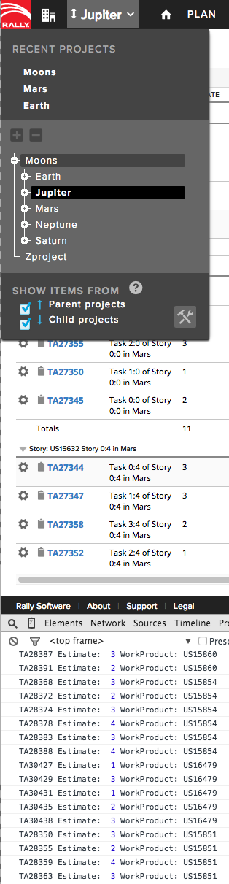

Promises Example: from Initiatives to Tasks
=========================

## Overview

Note the global scope settings. Apps by default assume global scope when running inside Rally. In this example if Initiatives are located in the current project's parent project, the app will not return expected data unless the global scoping is set to include items from parent projects

This app example is available AS IS. It is NOT supported by Rally.

## License

AppTemplate is released under the MIT license.  See the file [LICENSE](./LICENSE) for the full text.

##Documentation for SDK

You can find the documentation on our help [site.](https://help.rallydev.com/apps/2.0/doc/)
